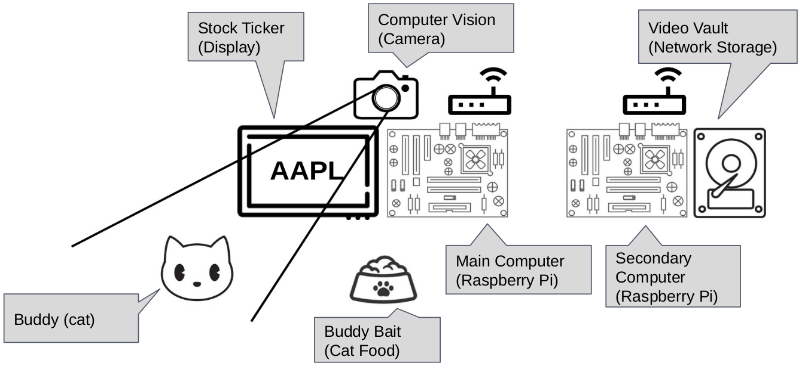
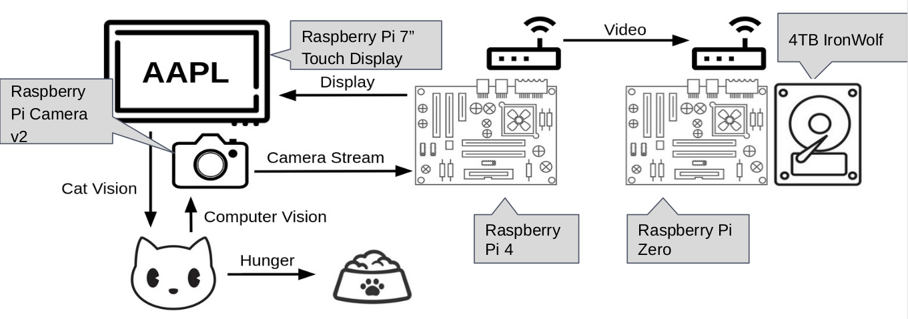
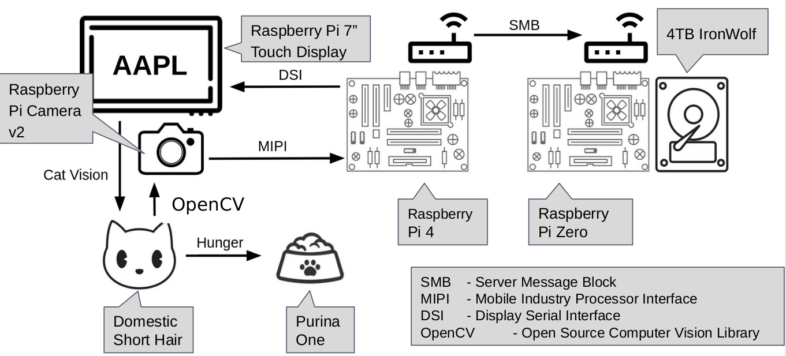
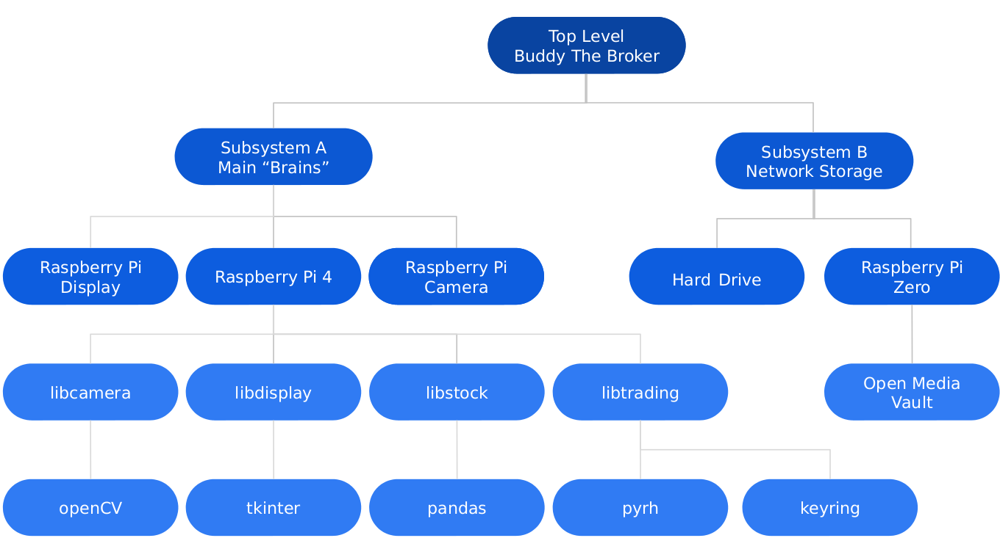
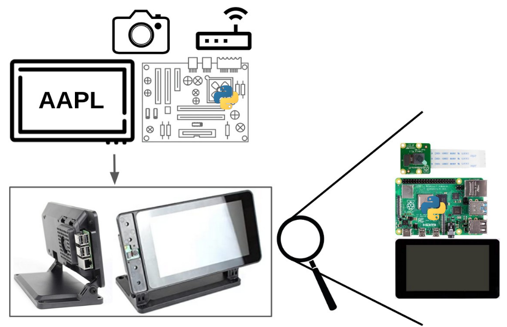
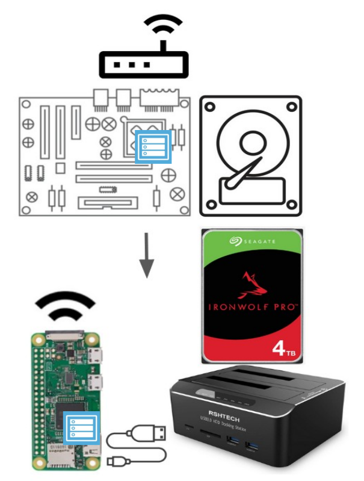

Buddy the Broker
================

|Doc badge| |Black badge| |License badge|

An embedded system allowing for my cat (Buddy) to trade stocks.

.. |Doc badge| image:: https://readthedocs.org/projects/buddythebroker/badge/?version=latest
    :target: https://buddythebroker.readthedocs.io/en/latest/?badge=latest
    :alt: Documentation Status

.. |Black badge| image:: https://img.shields.io/badge/code%20style-black-000000.svg
   :target: https://github.com/psf/black
   :alt: Code Formatter

.. |License badge| image:: https://img.shields.io/github/license/SamuelDonovan/BuddyTheBroker
   :alt: GitHub License

Schedule
========

* 10/10

   * ☑ Display Library (libdisplay) written

   * ☑ Raspberry Pis flashed and all necessary hardware connected

   * ☑ Network storage setup

* 10/17

   * ☑ Stock class (libstock) written

   * ☑ Trading library (libtrading) can buy and sell stocks

* 10/24

   * ☑ Camera library (libcamera) can identify cats and return coordinates

* 10/31

   * ☑ Camera library (libcamera) draws box and sends video to remote storage

   * ☑ Trading library (libtrading) algorithm started

* 11/7

   * ☑ Trading library (libtrading) algorithm completed

* 11/17

   * ☐ Main written connecting all libraries

* 11/28

   * ☐ Acceptance testing & polish product

* 12/5

   * ☐ Prepare final design report/demo

Abstract
========

Each year thousands of hedge funds and brokerages with armies of some of the most educated
individuals in finance each compete to make money in the stock market. These individuals comb
through heaps of data using some of the most complex strategies and spend countless hours in an
attempt to beat the market by even a couple percentage points. These individuals will now have a new
competitor on the horizon; the goal of my project is to put Wall Street's best and brightest up against
my cat, Buddy.

Each day, with the help of an embedded system to communicate his stock picks Buddy will go
paw to toe with investors and traders the world over. When presented with a variety of stock tickers
Buddy will be able to buy/sell stocks on the open market.

Project Description
===================

General Overview
----------------

A raspberry pi 4 will be positioned upon Buddy's feeder equipped with a screen and a camera
(all he will need to make his stock selections). The screen attached to the raspberry pi 4 will cycle
through potential stocks, displaying a new stock ticker at a consistent interval. When a stock ticker is
displayed that Buddy finds to be a sound investment he will sit in view of the attached camera for at
least half of the interval in which that stock ticker is displayed on the screen. The raspberry pi will
determine whether or not Buddy is sitting in front of the camera using computer vision. If the camera
has recognized Buddy as in view for half of the trading interval that the stock ticker is displayed then
the system will make note his stock selection and open a buy order. Once his account depletes its
purchasing power and he no longer has enough funds to execute his next stock pick the first stock he
purchased will be sold to allow for him to continue making purchases. This first in first out nature will
continue as he makes more and more stock picks. To not get Buddy's account flagged as a pattern day
trader he will be limited in the amount of buys that he can execute each day.

How does buddy know where to stand? Buddy’s feeder is set up on timer giving him constant
meals each day. Due to this consistency each day he lines up in font of his food dish a fair bit of time
before his food will be dispensed. Some meals he is front and center of his food bowl well over an hour
before its time for him to be feed. Other meals he may only show up five minutes before hand. Some
times he will stand in front of his bowl just hoping that it is feeding time and give up after a while. This
inconstant behavior can be leveraged as mechanism for his stock picks.

    Figure 1: OV-1 Diagram With Call Out Boxes

The operation view one (OV-1) diagram, Figure 1: OV-1 Diagram With Call Out Boxes,
illustrates all of major components of the system. It can be seen that the system is broken into two
separate physical pieces.

The first physical piece of the system will contain the main computer which will be interfacing
with the camera and display. The camera will detect Buddy using computer vision. The display will be
used to display the ticker that is currently available for purchase. As described previously Buddy will
be drawn to the system due to its placement above his food dispenser.
The second physical piece of the system will contain another raspberry pi used for video
storage. This raspberry pi will be connected to a hard drive in a remote location, able to communicate
with the first raspberry pi over the local area network (LAN) using each raspberry pi’s WiFi
capabilities.

At this point it should be noted that several diagrams have been chosen to use the Department
of Defense Architecture Framework (DoDAF) methodology due to its ability to easily convey
intricacies of a system.1 Several operations views have been omitted, due to the relative simplicity of
the system those generated are sufficient in properly explaining the system.

Similar Work
------------

Before anyone goes doubting Buddy’s trading prowess and thinks an embedded project in
which money is burn via a remote control flamethrower would yield the same results it is worth noting
that this is not the first project of its kind and there is a level of scholarly thought on this subject. In
1973, Princeton University professor Burton Malkiel claimed in his book ‘A Random Walk Down Wall
Street’ that, “A blindfolded monkey throwing darts at a newspaper's financial pages could select a
portfolio that would do just as well as one carefully selected by experts.” 2 As it would turn out
Malkiel was wrong and monkey often do a much better job than the experts. 2 The Wall Street Journal
has replicated this experiment each year by choosing 100 random stocks from the S&P 500 and
interestingly enough it will often bet the S&P 500. 3 Even the man arguably most famous for investing
has given credence to this idea. Warren Buffett is quoted as saying, “A patient and sensible monkey,
who builds a portfolio by throwing 50 darts at a board that includes the entire S&P 500 Composite
Index could increase his capital.” 4

At this point it is worth pointing out that a monkey throwing darts is really a tongue and cheek
analogy for picking stocks at random. Some YouTube personalities have taken this more literally.
Graham Stephen in his video, “I Spent $100,000 On A Stock Picking Monkey”, allowed for an actual
monkey to chose ten stocks which would comprise a $100,000 account. 5 Several months later in his
video titled, “How To Make Easy Money In The Stock Market”, Mr. Stephen goes on to show that his
monkey account did in fact perform better than comparative indexes. 6 It is worth noting that others
have conducted similar experiments as well with one YouTube personality allowing for his fish to trade
stocks, which again outperformed the market. A link to said YouTube personality will not be provided
due to the inappropriate humor in said video.

The point to be made is that this is by no means a new idea nor is it one I would expect to fail
miserably. The goal of this project is to simply put a new spin on the idea and perhaps get my cat a new
scratching tower in the process.

Capabilities And Limitations
----------------------------

Capabilites
~~~~~~~~~~~

Capabilities will be covered at various levels of detail throughout this document. The main
sections to point out would be the following:

* Libcamera
* Libdisplay
* Libstock
* Libtrading
* Remote Storage (Open Media Vault Use Case)

Essentially the main capabilities will include a camera application programming interface (API)
with the ability to detect cats, a display API with the ability to display stock tickers, a stock API with
the ability to fetch various stock information, a trading API with the ability to buy/sell stocks, and the
ability to store video on a separate remote drive. These separate capabilities when combine make up the
indented use case for this project.

Limitations
~~~~~~~~~~~

Given the specificity of the goal of this project the design should enable it the end product to
achieve its desired goal without too many draw backs. The main two that I see with the current design
are:

1. Lack of processing power on the Raspberry Pi 4

While the Raspberry Pi 4 is an impressive little computer, computer vision is no easy task. For
this reason the frame rate or even quality may be severally limited. Since the use case of this design is
to only ensure that a cat is present for several minutes at a time this should be a trade off that is easy to
live with. If this project needed to detect a multitude of different objects with millisecond precision this
would be an issue, but for the purpose of this project a Raspberry Pi 4 should be more than enough.

2. Using a static list of stocks

The current planned implementation uses a pre-downloaded list of stocks to form the data frame
used for stock data. The current list of stocks includes the top 1000 U.S. stocks sorted by market
capitalization. Should this order change in the near future the order in which the stocks are presented
could be slightly unaligned with the current market. Or if stock number 1000 is having a bad month
and stock number 1001 is having a good month the placements could swap leaving my system with a 
stale data set. For the purpose of this project the easy of using a pre-downloaded data set outweigh
these drawbacks. The order in which the stocks are presented is not incredibly important so long as
they are presented in an even distribution giving each a likely chance to be bought. Similarly, if stock
number 1001 is bought over stock number 1000 it doesn’t seem it would terribly effect the overall
functioning of this project given that these stocks will likely be bought and sold relatively frequently.

Interface Description
=====================

General Overview
----------------

Further breaking down the system we can see the interactions between each of the physical
modules. The operation view two (OV-2) diagram, Figure 2: OV-2 Diagram With Call Out Boxes,
illustrates these interactions. In the center of the diagram the it is shown that the Raspberry Pi which
will interface with the camera and display will be a Raspberry Pi 4. A Raspberry Pi 4 is required here as
computer vision software is computationally intensive. As shown in the diagram this Raspberry Pi will
interface with the both the display, showing the stock tickers, and the camera, determining if a cat is in
view. In theory Buddy would see the stock ticker and position himself in front of the camera (perhaps
while eating) enabling the system to purchase the desired stock.

All video captured from the camera will to sent to a Raspberry Pi Zero in another room. A
Raspberry Pi Zero should be more than sufficient as this Raspberry Pi will simply be interacting with a
hard drive as well as with the local area network (LAN). This remote storage will allow for the stock
picks to be verified and also show the fun computer vision cat identification boxes.

    Figure 2: OV-2 Diagram With Call Out Boxes

Notably OV-2 diagrams show the “what” not the “how” of interactions. If this diagram still
leaves some to be desired in terms of interface description these interfaces can be expanded upon
calling out the actually protocol being used. In Figure 3: OV-2 Diagram - Interfaces Expanded it can be
seen that Display Serial Interface (DSI) is the protocol used for the interface between the Raspberry Pi
4 and the display, Mobile Industry Processor Interface (MIPI) is the protocol used for the interface
between the Raspberry Pi 4 and the camera, and Server Message Block (SMB) is used for the interface
between the Raspberry Pi 4 and Raspberry Pi Zero. OpenCV is also specified as the method in which
computer vision will be used though it should be noted that this is a library rather than a protocol.

    Figure 3: OV-2 Diagram With Call Out Boxes

Functional Description
======================

Project Hierarchy
-----------------

Breaking down the hierarchy of this project there will be two physical subsystems each
comprised of their own hardware. Following Figure 4: OV-4 Diagram, the first subsystem will be
denoted as subsystem A which will be comprised of the Raspberry Pi Display, Raspberry Pi 4, and
Raspberry Pi Camera. The second subsystem will be denoted as subsystem B which will be comprised
of the hard drive and Raspberry Pi Zero.

The next layer down shows the software level for each subsystem. Subsystem A will use four
custom libraries written for this project, libcamera will deal with any camera interactions, libdisplay
will deal with any display interactions, libstock will provide stock tickers, and libtrading will enable
stock trading. This modularized architecture was chosen to allow for separation of responsibilities and
a cleaning overall software architecture. Staying on this software level of the diagram subsystem B will
be using Open Media Vault. Which is an open source program allowing for network mounted storage.

Following the diagram to its final, bottom layer are libraries leveraged to create the four
necessary libraries for this project’s use case. Each library is given a quote summarizing what it does as
well as a link to each library in the later section Python Libraries Leveraged but the relation of every
library can clearly be seen in the diagram.

    Figure 4: OV-4 Diagram

Subsystem A: Main “Brains”
--------------------------

To get a more realistic depiction of what subsystem A will look like Figure 5: Subsystem A is
provided. It can be seen that the camera, display, and Raspberry Pi will all fit together neatly in one
case. This assembly will be mounted atop Buddy’s food dispenser. This case an pivot allowing for the
optimum camera angle to get the best view of Buddy. The Python logo on both the cartoon Pi and the
“real” Pi depicts that this subsystem will be using Python for its various libraries.

    Figure 5: Subsystem A

Libcamera
~~~~~~~~~

This library will use computer vision to locate any cats (Buddy) in frame and return the
coordinates. This library also will save off the recorded video to a remote hard drive, see sections
Subsystem B: Network Storage and Remote Storage (Open Media Vault Use Case).

Libstock
~~~~~~~~

This library will return stock information given an index. This library will use the top 1000
stocks ordered by market capitalization.

Libtrading
~~~~~~~~~~

This library provides a means to interact with some brokerage account in order to allow for
automated buying and selling of stocks. There are several trading accounts that support this but I've
chosen Robinhood as I already have an open account, the API is free to use, and the app would allow
me to easily monitor Buddy’s stock picks while at work.

Moreover, the system will need the smarts to keep track of the order I'm which the stocks had
been picked in which order to know which to sell first, how much money is left in the account, the
number of trades made each day for each stock to prevent the account as being flagged as a pattern day
trader, and buffering of any stock picks (if made while the market is closed) until market open.

Libdisplay
~~~~~~~~~~

Display the ticker of the current stock that Buddy could buy. This will display a new stock
ticker on a regularly interval.

Subsystem B: Network Storage
----------------------------

To get a more realistic depiction of what subsystem B will look like Figure 6: Subsytem B is
provided. It can be seen that Raspberry Pi will be connected to a hard drive docking station via a USB
cable. This hard drive docking station will house a 4TB hard drive. The Open Media Vault logo on both
the cartoon Pi and the “real” Pi depicts that this subsystem will be running Open Media Vault for its
operations.

    Figure 6: Subsystem B

Remote Storage (Open Media Vault Use Case)
~~~~~~~~~~~~~~~~~~~~~~~~~~~~~~~~~~~~~~~~~~

What is a computer vision project without video and boxes drawn around identified objects? All
video recordings of Buddy should be keep to ensure all of his stock trades are being faithfully executed.

Why not use local storage on the Raspberry Pi 4 from subsystem A? The microSD slot on the pi
4 would only allow for so much video play back and while one could connect a hard drive directly to
the Pi from subsystem A that would make for a bulky setup and the HDD could easily be damaged by
Buddy. Moreover, it would just be more fun to send the footage off to be saved in another room and
this way it can easily accessed by any device on the network.
