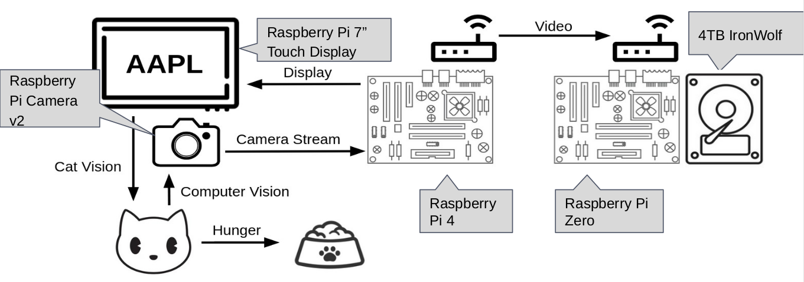

.. toctree::
   :maxdepth: 2
   :caption: Contents:

Interface Description
=====================

General Overview
----------------

Further breaking down the system we can see the interactions between each of the physical
modules. The operation view two (OV-2) diagram, Figure 2: OV-2 Diagram With Call Out Boxes,
illustrates these interactions. In the center of the diagram the it is shown that the Raspberry Pi which
will interface with the camera and display will be a Raspberry Pi 4. A Raspberry Pi 4 is required here as
computer vision software is computationally intensive. As shown in the diagram this Raspberry Pi will
interface with the both the display, showing the stock tickers, and the camera, determining if a cat is in
view. In theory Buddy would see the stock ticker and position himself in front of the camera (perhaps
while eating) enabling the system to purchase the desired stock.

All video captured from the camera will to sent to a Raspberry Pi Zero in another room. A
Raspberry Pi Zero should be more than sufficient as this Raspberry Pi will simply be interacting with a
hard drive as well as with the local area network (LAN). This remote storage will allow for the stock
picks to be verified and also show the fun computer vision cat identification boxes.

    Figure 2: OV-2 Diagram With Call Out Boxes

Notably OV-2 diagrams show the “what” not the “how” of interactions. If this diagram still
leaves some to be desired in terms of interface description these interfaces can be expanded upon
calling out the actually protocol being used. In Figure 3: OV-2 Diagram - Interfaces Expanded it can be
seen that Display Serial Interface (DSI) is the protocol used for the interface between the Raspberry Pi
4 and the display, Mobile Industry Processor Interface (MIPI) is the protocol used for the interface
between the Raspberry Pi 4 and the camera, and Server Message Block (SMB) is used for the interface
between the Raspberry Pi 4 and Raspberry Pi Zero. OpenCV is also specified as the method in which
computer vision will be used though it should be noted that this is a library rather than a protocol.

.. figure:: images/interface_description/ov2_diagram_interface_expanded.png
    :alt: OV-2 Diagram (Interface Expanded)
    :align: center

    Figure 3: OV-2 Diagram With Call Out Boxes
